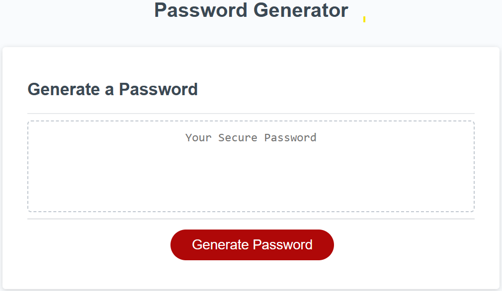

# JavaScript: Password Generator

link to deploy  https://gonzalogodinez.github.io/PasswordGen2/

**Description**

As a developer we are required to modify an existing code that creates an application to allow employees to generate a random password that enables employees to generate random passwords based on criteria selected on the screen featuring the use of HTML and CSS powered by updated JavaScript and the ability to be displayed in different screen sizes.

The random password lenght is between 8 and 128 characters and, can include lowercase, uppercase, numeric and/or special characters, the above characters will be prompted each of them for approved employee selection or preference.

Once all selections are accepted passing the above criteria the Random password will be displayed.

If an erroneous lenght or incorrect criteria is selected a warning mesagge will be displayed.

**Installation**

1.  Install Visual Studio
2.  GUI bash terminal point using CD into project directory.
3.  Git clone this repo.
4.	CD into JavaScript.
5.  Deploy into GITHUB 
6.  Git pull
4.	Open using text editor, for VS Code, command 'code .'

**Usage**

# JavaScript initial coding steps

License

MIT License

Copyright (c) 2023 GonzaloGodinez

Permission is hereby granted, free of charge, to any person obtaining a copy of this software and associated documentation files (the "Software"), to deal in the Software without restriction, including without limitation the rights to use, copy, modify, merge, publish, distribute, sublicense, and/or sell copies of the Software, and to permit persons to whom the Software is furnished to do so, subject to the following conditions:
The above copyright notice and this permission notice shall be included in all copies or substantial portions of the Software.
THE SOFTWARE IS PROVIDED "AS IS", WITHOUT WARRANTY OF ANY KIND, EXPRESS OR IMPLIED, INCLUDING BUT NOT LIMITED TO THE WARRANTIES OF MERCHANTABILITY, FITNESS FOR A PARTICULAR PURPOSE AND NONINFRINGEMENT. IN NO EVENT SHALL THE AUTHORS OR COPYRIGHT HOLDERS BE LIABLE FOR ANY CLAIM, DAMAGES OR OTHER LIABILITY, WHETHER IN AN ACTION OF CONTRACT, TORT OR OTHERWISE, ARISING FROM, OUT OF OR IN CONNECTION WITH THE SOFTWARE OR THE USE OR OTHER DEALINGS IN THE SOFTWARE.
